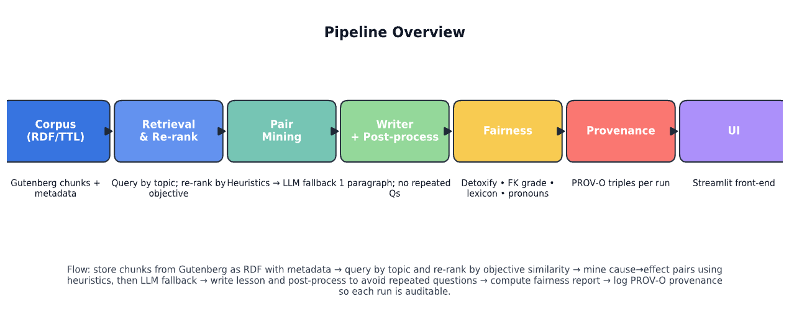
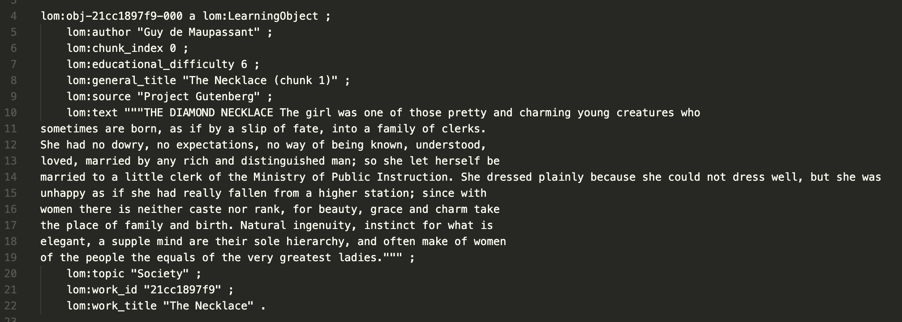

# Fair & Explainable Tutor — Grounded Lesson Generation with Governance

[](https://www.python.org/)
[](https://streamlit.io/)
[](https://aws.amazon.com/elasticbeanstalk/)
[](https://www.docker.com/)

  
**Live Demo:** http://fair-explainable-tutor-env.eba-r3jqmdmw.eu-west-2.elasticbeanstalk.com/

> A transparent, auditable pipeline that generates **short, grounded lessons** on a single objective—**cause and effect**—from classic short stories and surfaces **fairness** & **provenance** signals for governance.

---

## Table of Contents

- [Overview](#overview)
- [Aims & Objectives](#aims--objectives)
- [Key Features & Contributions](#key-features--contributions)
- [Architecture](#architecture)
- [Pipeline: How It Works](#pipeline-how-it-works)
- [Repository Structure](#repository-structure)
- [Quickstart (Local)](#quickstart-local)
- [Model Backends & Configuration](#model-backends--configuration)
- [Data: Corpus Build & RDF](#data-corpus-build--rdf)
- [Evaluation (Testing & Metrics)](#evaluation-testing--metrics)
- [Deployment](#deployment)
  - [Docker (local)](#docker-local)
  - [AWS Elastic Beanstalk (single container)](#aws-elastic-beanstalk-single-container)
  - [CI/CD with GitHub Actions](#cicd-with-github-actions)
- [Provenance, Ethics & Governance](#provenance-ethics--governance)
- [Monitoring, Logs & Artifacts](#monitoring-logs--artifacts)
- [Troubleshooting](#troubleshooting)
- [Roadmap](#roadmap)
- [License](#license)
- [Acknowledgements](#acknowledgements)

---

## Overview

Large Language Models (LLMs) can generate impressive educational content, but typical risks include **ungrounded claims**, **repetitive/weak questions**, and **opaque generation processes** that complicate review and audit.  
This project implements a **narrowly scoped** learning objective—**teach cause and effect**—and delivers a **RAG-style** (Retrieval-Augmented Generation) pipeline that:

- Anchors the lesson in **real text** (classic short story excerpts),
- Extracts **cause–effect pairs** to explain *why* content is selected,
- Enforces **format and quality** via a robust post-processor,
- Computes a **fairness panel** (toxicity, readability, non-inclusive lexicon, pronoun balance, a light stereotype heuristic),
- Logs **PROV-O provenance** so that every run is **reproducible and auditable**.

The app ships with a **Streamlit UI** for a transparent demo and is deployable via **Docker** and **AWS Elastic Beanstalk**, with an optional **GitHub Actions** CI/CD workflow.

---

## Aims & Objectives

**Aim:** Generate **one concise paragraph** (≈120–160 words) and **exactly three distinct comprehension questions** that teach **cause and effect**, grounded in retrieved passages from a curated corpus.

**Objectives:**
1. **Grounded Generation** — Use a curated RDF/TTL corpus (e.g., Project Gutenberg chunks) to ensure text is anchored.
2. **Explainability** — Mine explicit **cause–effect pairs** and show how passages support the learning objective.
3. **Governance** — Provide **fairness signals** and **provenance** for transparency, auditability, and reproducibility.
4. **Reproducible Demos** — Build a Streamlit UI and Docker image, with deployment on AWS Elastic Beanstalk and CI/CD.

**Non-goals:** Broad personalization across many learner dimensions; wide topic coverage; general-purpose question generation.

---

## Key Features & Contributions

- **RAG-style retrieval** aligned with a **pedagogical objective** (cause ⇢ effect).
- **Hybrid pair-mining:** lightweight heuristics + **strictly constrained LLM fallback** (context-only) when needed.
- **Writer + post-processor:** ensures format, deduplicates, **guarantees exactly three distinct questions**, trims verbosity.
- **Fairness panel:** toxicity (Detoxify), FK-grade readability, non-inclusive lexicon, pronoun balance, stereotype heuristic.
- **Provenance (PROV-O):** records inputs, outputs, model ID and parameters, and timestamps per run.
- **Streamlit UI:** transparent rendering of contexts, pairs, lesson, fairness, and provenance.
- **Cloud-ready:** Dockerized app; AWS EB single-container deployment; GitHub Actions CI/CD workflow.

---

## Architecture
> 
>
---

## Pipeline: How It Works

1. **Retrieval & Re-ranking**
   - Filter corpus by **topic** and minimum length.
   - Re-rank by **semantic similarity** to the objective (“teach cause and effect in short stories”).

2. **Pair Mining (Explainability)**
   - **Heuristics:** scan for causal cues such as *because, led to, caused, therefore, thus, consequently*.
   - **Fallback LLM (context-locked):** if <2 good pairs found, prompt a small LLM to extract pairs as strict JSON (no external facts allowed).

3. **Writer & Post-Processing**
   - LLM writes **one paragraph** (≈120–160 words) + **3 questions**.
   - Post-processor **deduplicates** sentences, **enforces Q1–Q3**, **replaces repeats** with diverse templates, and **trims** to target length.

4. **Fairness Panel**
   - **Toxicity** (Detoxify), **Readability** (Flesch–Kincaid), **Non-inclusive lexicon**, **Pronoun balance**, **Stereotype heuristic**.
   - If thresholds fail, perform **one** safety rewrite; **show both versions**.

5. **Provenance (PROV-O)**
   - Each run becomes a **prov:Activity** with links to inputs/outputs, model details, and timestamps, written to `rdf/provenance.ttl`.

---

## Repository Structure

```
fair-explainable-tutor/
├─ app.py                       # Streamlit entry (landing + links)
├─ 01_Try_the_Tutor.py          # Main interactive page (generator UI)
├─ data/
│  └─ rdf/
│     └─ corpus.ttl             # RDF/TTL corpus (chunks & metadata)
├─ rdf/
│  └─ provenance.ttl            # PROV-O log (appended per run)
├─ src/
│  ├─ rdf/
│  │  └─ build_corpus.py        # Build TTL from CSV (title/topic/level/text)
│  ├─ generation/
│  │  ├─ retrieval.py           # RDF queries & re-ranking
│  │  ├─ planning.py            # Heuristic pair mining + LLM fallback
│  │  ├─ writing.py             # Writer & robust post-processing
│  │  ├─ fairness.py            # Detoxify/readability/lexicon/pronoun checks
│  │  ├─ utils.py               # Chat backends, device handling, caching
│  │  ├─ generate.py            # Orchestrator for a single run
│  │  └─ batch_run.py           # Batch topics runner (optional)
│  └─ provenance/
│     └─ prov.py                # Append PROV-O triples per run
├─ outputs/
│  ├─ run-*.json                # Full run metadata (contexts, pairs, fairness)
│  └─ run-*.txt                 # Lesson + Q1–Q3 text
├─ Dockerfile
├─ Dockerrun.aws.json           # (optional local test) EB single-container
├─ requirements.txt
└─ .github/
   └─ workflows/
      └─ deploy.yml             # CI/CD: smoke-test, build/push ECR, deploy EB
```

---

## Quickstart (Local)

### Prerequisites

- Python **3.11**
- (Optional) **OpenAI** account if using the OpenAI backend
- (Optional) **Hugging Face** token for private models

### 1) Create a virtual environment

```bash
python3.11 -m venv .venv
source .venv/bin/activate  # On Windows: .venv\Scripts\activate
python -m pip install --upgrade pip
pip install -r requirements.txt
```

### 2) Set environment variables

Create a `.env` (or export in your shell):

```bash
# OpenAI backend (recommended for demo)
export OPENAI_API_KEY="sk-..."

# Hugging Face (optional if using HF models)
export HF_TOKEN="hf_..."
# Improve model cache location (Transformers v5 recommends HF_HOME)
export HF_HOME="$HOME/.cache/huggingface"
```

### 3) Run the app

```bash
streamlit run app.py --server.port=8080 --server.address=0.0.0.0
# then open http://localhost:8080
```

**Tip:** If you see Detoxify downloading on first run, that’s normal locally. In Docker images, the checkpoint can be pre-cached.

---

## Model Backends & Configuration

- **OpenAI** (default in UI): typically **faster** and **lighter memory**.
  - Example: `gpt-4o-mini` (configure in the UI).
- **Hugging Face** (local models):
  - Example: `microsoft/Phi-3-mini-4k-instruct`
  - Expect slower cold starts and higher RAM. On small cloud instances, prefer OpenAI.

**UI behavior:**
- Selecting **OpenAI** disables HF model dropdown.
- Selecting **Hugging Face** shows a warning—**models can be slow to load**.

---

## Data: Corpus Build & RDF

- Corpus built from classic short stories (e.g., Project Gutenberg), chunked to ~**150–300 words** with metadata:
  - `lom:general_title`, `lom:topic`, `lom:educational_difficulty` (3–9), `lom:text`, `lom:source`.
- Script: `src/rdf/build_corpus.py` consumes a CSV → produces `data/rdf/corpus.ttl`.

> **Chunk example:**  
> 

---

## Evaluation (Testing & Metrics)

Focused evaluation for governance:

- **Grounding quality:** lesson references align with retrieved passages and extracted pairs.
- **Question quality:** three **distinct** causal questions; answerable from the lesson.
- **Fairness signals:** toxicity (Detoxify), readability (FK Grade target band ~5–9), non-inclusive lexicon hits, pronoun balance.
- **Provenance completeness:** each run logs inputs, outputs, model ID, parameters, timestamps.

> **Note on FK assumptions**: FK Grade is a **readability proxy**, not a comprehension score.

---

## Deployment

### Docker (local)

```bash
# build
docker build -t fair-tutor:local .

# run (port 8080)
docker run --rm -p 8080:8080 \
  -e OPENAI_API_KEY=$OPENAI_API_KEY \
  fair-tutor:local
# visit http://localhost:8080
```

### AWS Elastic Beanstalk (single container)

1. **Push image to ECR** (multi-arch not needed; EB EC2 is **linux/amd64**).
2. **Create** `Dockerrun.aws.json` with your ECR image (port **8080**):
   ```json
   {
     "AWSEBDockerrunVersion": "1",
     "Image": {
       "Name": "864624564382.dkr.ecr.eu-west-2.amazonaws.com/fair-explainable-tutor:latest",
       "Update": "true"
     },
     "Ports": [
       { "ContainerPort": "8080" }
     ],
     "Logging": "/var/log/nginx"
   }
   ```
3. Zip the Dockerrun and **Create Application Version** in EB.
4. **Update environment** to the new version.
5. Start with **t3.small** or larger (memory headroom for HF+Detoxify).

### CI/CD with GitHub Actions

This repo includes `.github/workflows/deploy.yml` that:

1. Builds and **pushes** an **amd64** image to **ECR**.
2. Creates a **unique** Elastic Beanstalk application version and **deploys** it.

**Requirements:**
- **OIDC role** for GitHub Actions with permissions on ECR, S3 (EB bucket), EB, and CloudFormation (read).
- Repo **secrets**:
  - `AWS_REGION` (e.g., `eu-west-2`)
  - `AWS_OIDC_ROLE_ARN`
  - `ECR_REPOSITORY` (e.g., `fair-explainable-tutor`)
  - `ECR_REGISTRY` (e.g., `864624564382.dkr.ecr.eu-west-2.amazonaws.com`)
  - `EB_APP_NAME`, `EB_ENV_NAME`, `EB_S3_BUCKET`

---

## Provenance, Ethics & Governance

- **Provenance (PROV-O):** Every run appends triples to `rdf/provenance.ttl`:
  - `prov:Activity` with `prov:used` (corpus/contexts) and `prov:wasGeneratedBy` (lesson outputs),
  - `dct:creator` linking to a tool agent,
  - Model ID, backend, and generation parameters.
- **Fairness panel:** early signals for review—not a certification.
- **Privacy:** no personal data is retained by default.
- **Licensing of texts:** ensure the corpus respects the licenses of the underlying sources (e.g., Project Gutenberg terms).

---

## Monitoring, Logs & Artifacts

- **Run artifacts:** saved under `outputs/`  
  - `run-*.json` (full metadata)  
  - `run-*.txt` (final lesson + Q1–Q3)
- **Provenance:** `rdf/provenance.ttl`
- **Cloud logs (EB):** `eb-engine.log`, `nginx/error.log` for deployment & runtime issues.

---

## Troubleshooting

- **502 Bad Gateway** on EB:
  - Confirm `Dockerrun.aws.json` exposes **ContainerPort 8080** and your container **listens on 8080**.
  - Check health events in the EB console & instance logs.

- **“no matching manifest for linux/amd64”**:
  - Build & push the image as **linux/amd64** (the workflow already does this via `buildx`).

- **Instance restarts / “Connecting…” loop in Streamlit**:
  - Instance is likely **out of memory**. Try **t3.small** or larger.
  - Prefer **OpenAI** backend for lower RAM usage.

- **S3 “does not allow ACLs”**:
  - Ensure the EB S3 bucket has **Object Ownership → Bucket owner enforced** and you aren’t setting ACLs explicitly.

- **Detoxify downloads on first request**:
  - Locally: expected on first run.
  - In Docker: you can pre-cache the checkpoint during the build stage (already supported in the provided Dockerfile pattern).

---

## Roadmap

- Expand beyond **cause–effect** to additional learning objectives.
- Stronger **bias detection** using labeled pipelines (e.g., AIF360).
- Richer **provenance** (hashing outputs, parameter ontologies).
- Opt-in **learner profile** to tune retrieval & style (privacy-preserving).
- Export **explanations** for reviewers (HTML/PDF bundle).

---

## License & Academic Use

This repository accompanies an academic dissertation and includes multiple kinds of artifacts with different licenses:

- **Code** (everything under `src/`, `app.py`, Streamlit pages, and utility scripts):  
  Licensed under the **MIT License** © 2025 Mohammad Faraz Ahmed. See `LICENSE` for the full text.

- **Text, figures, and documentation** (e.g., dissertation excerpts, README content, diagrams/screenshots in `docs/` or root):  
  Licensed under **CC BY-NC 4.0**. You may share and adapt with attribution for **non-commercial** purposes.

- **Corpus, model weights, and third-party assets**:  
  Not covered by the above licenses. Each retains its **original upstream license/terms**.  
  Examples:
  - Classic texts (e.g., Project Gutenberg): follow the source’s terms of use.
  - Model weights and tokenizers (e.g., Detoxify, Hugging Face models): follow the model authors’ licenses.
  - Fonts/icons/images: follow their respective licenses.

### Warranty & Intended Use
This is a **research prototype** provided “as is,” without warranty of any kind. It is not certified for classroom deployment without independent review of pedagogy, fairness, and privacy requirements.

### Citation
If you build upon this work in academic or research settings, please cite the dissertation or this repository. A `CITATION.cff` file can be added for convenience if needed.

---

## Acknowledgements

- Project Gutenberg (sources for classic texts).
- Detoxify (toxicity model).
- Streamlit.
- PROV-O (W3C Provenance Ontology).
- Hugging Face / OpenAI model backends.

---
